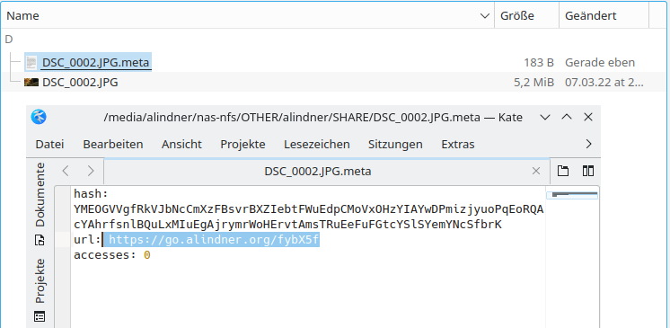
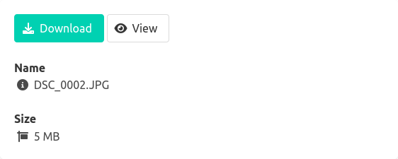
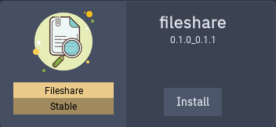

# go-fileshare

A quite simple and dirty go application for sharing files on a local directory through a builtin webserver.

## Features
* Only 10.7 MB of Docker image
* Cross-platform

## Screenshots



## How does this work?

The application is started using docker and watches any mounted directory.
If a new file is created in the directory, a hash is generated and stored in a meta file next to the file (see the first screenshot).
The webserver provides the file and its metadata using this hash.
A simple key-value file (`data.yaml`) is used to store the hash and the file name to improve the performance.
A simple `config.yaml` file is used to configure the application.
To delete a shared file, simply delete the file (and the meta file).

An additional feature is shortify the url using a custom [Kutt](https://kutt.it) installation.

## Background

I'm running a TrueNAS Scale server with a NFS share (as well as an SMB share).
I simply want to share a file on that network drive with other persons.
My main requirement was to only invest a couple of hours - so no fancy dolphin integration or complex web ui.
So here my solution, quite simple and very dirty ;).

## Installation

Create a `config.yaml` file somewhere with this content:
```yaml
DataFile: data.yaml
BaseUrl: http://localhost:8080/ # so the generated urls are correct
kutt: # Kutt data
  key: ....
  enabled: false
  url: https://kutt.yourdomain.com/
hashLength: 128
```
The image is based on the `distroless` image and therefore, the user `nonroot (65532:65532)` is used internally.
Set the correct file permissions for the `config.yaml` file, the `data.yaml` file and the shared dir, for example:
`chown :65532 config.yaml -R && chmod 660 config.yaml`.

After starting the container using a method from down below, optionally add a reverse proxy in front of the container.

### Docker

```shell
docker run -ti  --name="fileshare" --restart="always" -v $(pwd)/data:/data -v $(pwd)/config:/workdir -p 8080:8080 ghcr.io/alexander-lindner/go-fileshare:latest
```

### Docker-compose

```yaml
version: '3.3'
services:
    fileshare:
        restart: always
        volumes:
            - './data:/data'
            - './config:/workdir'
        ports:
            - '8080:8080'
        image: 'ghcr.io/alexander-lindner/go-fileshare:latest'
```
### TrueNAS Scale (Helm)

Add this repo as a Catalog:

| Key | Value |
| --- | --- |
| Name | `go-fileshare` |
| Url | `https://github.com/alexander-lindner/go-fileshare` |
| Branch | `master` |
| Preferred Trains| `stable` |

Find the application and install it:



Configure the path and add your Ingress configuration.

## Customizing

You can customize the web ui by mounting a custom `static` directory next to the `config.yaml`.
Start by coping the `static` directory from the current running container:
```shell
docker cp CONTAINER_ID:/static ./static
```
Then restart the container.
The webserver provides an api under the `/[HASH]/api` path.
`/[HASH]/download` is the path for downloading, `/[HASH]/view` for previewing.

## ToDo's

* share directories
* support deleting files
* multiple mounted directories
* support custom Kutt url

## Etc

<a target="_blank" href="https://icons8.com/icon/111132/file">File</a> icon by <a target="_blank" href="https://icons8.com">Icons8</a>